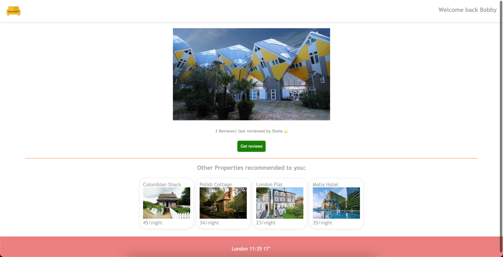

# Couch Surfing Website
- The companion project of the course.

  

- To run this project with `Visual Studio Code`, you'll need to
  - Step 1: Open the terminal and run `tsc -w`
  - Step 2: Install the `Live Server` extension which allows you to create a localhost server.
  - Step 3: Open `index.html` file, click the `Go Live` button at the bottom right and a localhost server with a specific port will be created and the `index.html` file will be opened on the browser directly.